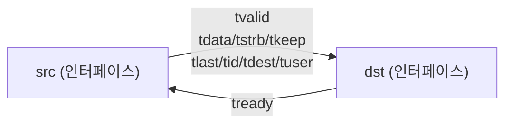

# assign.svh

AXI4-Stream 인터페이스·struct 간 신호 연결을 위한 SystemVerilog 매크로 모음. 반복적인 assign 구문을 단일 매크로 호출로 대체한다.

---

## 매크로 목록

### 내부 구현 매크로 (직접 사용 지양)

#### `` `__AXI_STREAM_TO_S ``
채널 신호(data/strb/keep/last/id/user/dest)를 한 경로에서 다른 경로로 assign한다.

```systemverilog
`__AXI_STREAM_TO_S(__opt_as, __lhs, __lhs_sep, __rhs, __rhs_sep)
// 예: assign dst.t.data = src.t.data; (7개 신호)
```

#### `` `__AXI_STREAM_TO_REQ ``
채널 신호 전체 + `tvalid`를 assign한다.

#### `` `__AXI_STREAM_TO_RSP ``
`tready` 하나만 assign한다.

---

### 인터페이스 ↔ 인터페이스

#### `` `AXI_STREAM_ASSIGN(dst, src) ``

두 `AXI_STREAM_BUS` 인터페이스를 양방향으로 연결한다 (`assign slv = mst` 동작).

```systemverilog
`AXI_STREAM_ASSIGN(dst, src)
// 展開:
//   assign dst.t.{data,strb,keep,last,id,user,dest} = src.t.{...};
//   assign dst.tvalid = src.tvalid;
//   assign src.tready = dst.tready;   ← tready 방향 주의
```



> **주의**: `tready`는 `dst → src` 역방향으로 연결된다. Tx 포트를 `dst`에, Rx 포트를 `src`에 넣어야 한다.

---

### 인터페이스 ← struct (외부 process 밖)

#### `` `AXI_STREAM_ASSIGN_FROM_REQ(axi_if, req_struct) ``
request struct → 인터페이스 출력 방향 연결.

```systemverilog
// axi_if.tvalid     = req_struct.tvalid
// axi_if.t.data ... = req_struct.t.data ...
```

#### `` `AXI_STREAM_ASSIGN_FROM_RSP(axi_if, rsp_struct) ``
response struct → 인터페이스 출력 방향 연결 (`tready`만).

```systemverilog
// axi_if.tready = rsp_struct.tready
```

#### `` `AXI_STREAM_ASSIGN_FROM_S(axi_if, s_struct) ``
채널 struct(s_chan_t) → 인터페이스 `.t.*` 필드 연결.

---

### struct ← 인터페이스 (외부 process 밖)

#### `` `AXI_STREAM_ASSIGN_TO_REQ(req_struct, axi_if) ``
인터페이스 → request struct 방향 연결.

```systemverilog
// req_struct.tvalid     = axi_if.tvalid
// req_struct.t.data ... = axi_if.t.data ...
```

#### `` `AXI_STREAM_ASSIGN_TO_RSP(rsp_struct, axi_if) ``
인터페이스 → response struct 방향 연결 (`tready`만).

#### `` `AXI_STREAM_ASSIGN_TO_R(s_struct, axi_if) ``
인터페이스 `.t.*` → 채널 struct(s_chan_t) 방향 연결.

---

### Flat 포트 ↔ struct (Vivado 네이밍 규칙)

#### `` `AXI_STREAM_ASSIGN_TO_FLAT(__name, __req, __rsp) ``
request/response struct → flat `__name_t*` 출력 신호 연결.

```systemverilog
// assign __name_tvalid = __req.tvalid;
// assign __name_tdata  = __req.t.data;  ...
// assign __rsp.tready  = __name_tready;
```

#### `` `AXI_STREAM_ASSIGN_FROM_FLAT(__req, __rsp, __name) ``
flat `__name_t*` 입력 신호 → request/response struct 연결.

```systemverilog
// assign __req.tvalid  = __name_tvalid;
// assign __req.t.data  = __name_tdata;  ...
// assign __name_tready = __rsp.tready;
```

---

## 매크로 관계도

```mermaid
flowchart TB
  subgraph Public["공개 매크로"]
    A1["`AXI_STREAM_ASSIGN`"]
    A2["`AXI_STREAM_ASSIGN_FROM_REQ`"]
    A3["`AXI_STREAM_ASSIGN_FROM_RSP`"]
    A4["`AXI_STREAM_ASSIGN_FROM_S`"]
    A5["`AXI_STREAM_ASSIGN_TO_REQ`"]
    A6["`AXI_STREAM_ASSIGN_TO_RSP`"]
    A7["`AXI_STREAM_ASSIGN_TO_R`"]
    A8["`AXI_STREAM_ASSIGN_TO_FLAT`"]
    A9["`AXI_STREAM_ASSIGN_FROM_FLAT`"]
  end

  subgraph Internal["내부 매크로"]
    B1["`__AXI_STREAM_TO_S`\n(7개 채널 신호)"]
    B2["`__AXI_STREAM_TO_REQ`\n(채널 + tvalid)"]
    B3["`__AXI_STREAM_TO_RSP`\n(tready만)"]
  end

  A1 --> B2
  A1 --> B3
  A2 --> B2
  A3 --> B3
  A4 --> B1
  A5 --> B2
  A6 --> B3
  A7 --> B1
  B2 --> B1
```

---

## 사용 패턴 요약

| 용도 | 매크로 |
|------|--------|
| 인터페이스 간 전체 연결 | `` `AXI_STREAM_ASSIGN(dst, src) `` |
| 인터페이스 → req struct | `` `AXI_STREAM_ASSIGN_TO_REQ(req, if) `` |
| req struct → 인터페이스 | `` `AXI_STREAM_ASSIGN_FROM_REQ(if, req) `` |
| 인터페이스 → rsp struct | `` `AXI_STREAM_ASSIGN_TO_RSP(rsp, if) `` |
| rsp struct → 인터페이스 | `` `AXI_STREAM_ASSIGN_FROM_RSP(if, rsp) `` |
| flat 포트 → struct | `` `AXI_STREAM_ASSIGN_FROM_FLAT(req, rsp, name) `` |
| struct → flat 포트 | `` `AXI_STREAM_ASSIGN_TO_FLAT(name, req, rsp) `` |
