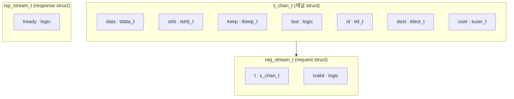

# typedef.svh

AXI4-Stream 채널·Request/Response struct 타입 정의를 위한 SystemVerilog 매크로 모음. 사용자가 직접 typedef를 반복 작성하지 않아도 되도록 일관된 struct 타입을 생성한다.

---

## struct 계층 구조



---

## 매크로 목록

### `` `AXI_STREAM_TYPEDEF_S_CHAN_T ``

AXI Stream 채널 신호를 담는 packed struct를 정의한다.

```systemverilog
`AXI_STREAM_TYPEDEF_S_CHAN_T(s_chan_t, tdata_t, tstrb_t, tkeep_t, tid_t, tdest_t, tuser_t)
// 결과:
typedef struct packed {
    tdata_t data;
    tstrb_t strb;
    tkeep_t keep;
    logic   last;
    tid_t   id;
    tdest_t dest;
    tuser_t user;
} s_chan_t;
```

| 인자 | 설명 |
|------|------|
| `s_chan_t` | 생성할 typedef 이름 |
| `tdata_t` | 데이터 타입 (예: `logic [31:0]`) |
| `tstrb_t` | 바이트 스트로브 타입 (예: `logic [3:0]`) |
| `tkeep_t` | 바이트 킵 타입 |
| `tid_t` | ID 타입 |
| `tdest_t` | 목적지 타입 |
| `tuser_t` | 사용자 사이드밴드 타입 |

---

### `` `AXI_STREAM_TYPEDEF_REQ_T ``

채널 struct와 `tvalid`를 포함하는 request struct를 정의한다.

```systemverilog
`AXI_STREAM_TYPEDEF_REQ_T(req_stream_t, s_chan_t)
// 결과:
typedef struct packed {
    s_chan_t t;
    logic    tvalid;
} req_stream_t;
```

| 인자 | 설명 |
|------|------|
| `req_stream_t` | 생성할 typedef 이름 |
| `s_chan_t` | 앞서 정의한 채널 struct 타입 |

---

### `` `AXI_STREAM_TYPEDEF_RSP_T ``

`tready`만 포함하는 response struct를 정의한다.

```systemverilog
`AXI_STREAM_TYPEDEF_RSP_T(rsp_stream_t)
// 결과:
typedef struct packed {
    logic tready;
} rsp_stream_t;
```

---

### `` `AXI_STREAM_TYPEDEF_ALL `` (편의 매크로)

위 세 매크로를 한 번에 호출하여 `__name_s_chan_t`, `__name_req_t`, `__name_rsp_t` 세 타입을 모두 생성한다.

```systemverilog
`AXI_STREAM_TYPEDEF_ALL(axi_stream, tdata_t, tstrb_t, tkeep_t, tid_t, tdest_t, tuser_t)
// 결과:
//   typedef struct packed {...} axi_stream_s_chan_t;
//   typedef struct packed {...} axi_stream_req_t;
//   typedef struct packed {...} axi_stream_rsp_t;
```

---

### Flat 포트 매크로 (Vivado 네이밍 규칙)

#### `` `AXI_STREAM_FLAT_PORT_TX ``

모듈 포트 선언부에서 Vivado 표준 TX(출력) flat 포트를 한 줄로 선언한다.

```systemverilog
`AXI_STREAM_FLAT_PORT_TX(__name, __DataWidth, __IdWidth, __DestWidth, __UserWidth)
// 결과: output logic [DataWidth-1:0] __name_tdata,
//        output logic [DataWidth/8-1:0] __name_tstrb,
//        ...
//        output logic __name_tvalid,
//        input  logic __name_tready
```

#### `` `AXI_STREAM_FLAT_PORT_RX ``

Vivado 표준 RX(입력) flat 포트를 선언한다.

> **버그 주의**: 현재 구현에 `__name_tlast` 라인에 `__Lw`라는 미정의 파라미터가 사용되어 있음. 직접 사용 시 수동 수정 필요.

---

## 매크로 호출 관계

```mermaid
flowchart TB
  ALL["`AXI_STREAM_TYPEDEF_ALL\n(__name, ...)` "]

  SCHAN["`AXI_STREAM_TYPEDEF_S_CHAN_T`\n→ __name_s_chan_t"]
  REQ["`AXI_STREAM_TYPEDEF_REQ_T`\n→ __name_req_t"]
  RSP["`AXI_STREAM_TYPEDEF_RSP_T`\n→ __name_rsp_t"]

  ALL --> SCHAN
  ALL --> REQ
  ALL --> RSP
  SCHAN -->|"s_chan_t 인자로 전달"| REQ
```

---

## 사용 예시

```systemverilog
// 타입 정의
typedef logic [31:0]  tdata_t;
typedef logic [3:0]   tstrb_t;
typedef logic [3:0]   tkeep_t;
typedef logic [0:0]   tid_t;
typedef logic [0:0]   tdest_t;
typedef logic [0:0]   tuser_t;

`AXI_STREAM_TYPEDEF_ALL(my_stream, tdata_t, tstrb_t, tkeep_t, tid_t, tdest_t, tuser_t)
// → my_stream_s_chan_t, my_stream_req_t, my_stream_rsp_t 생성

// 신호 선언
my_stream_req_t req;
my_stream_rsp_t rsp;

// 필드 접근
assign req.tvalid  = valid_in;
assign req.t.data  = data_in;
assign req.t.last  = last_in;
assign ready_out   = rsp.tready;
```

---

## Flat 포트 매크로 요약

| 매크로 | 용도 |
|--------|------|
| `` `AXI_STREAM_FLAT_PORT_TX `` | 모듈 포트 선언 — Vivado AXI Stream TX (output) |
| `` `AXI_STREAM_FLAT_PORT_RX `` | 모듈 포트 선언 — Vivado AXI Stream RX (input) |
