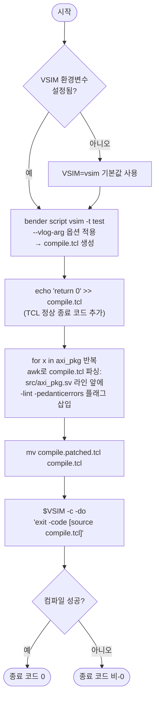

# compile_vsim.sh

QuestaSim(ModelSim)을 사용하여 AXI Stream 라이브러리를 컴파일하고 시뮬레이션을 실행하는 스크립트.

---

## 사용법

```bash
# 기본 실행 (vsim 명령어 사용)
bash scripts/compile_vsim.sh

# 커스텀 vsim 경로 지정
VSIM=/path/to/vsim bash scripts/compile_vsim.sh
```

## 환경 변수

| 변수   | 기본값 | 설명                              |
|--------|--------|-----------------------------------|
| `VSIM` | `vsim` | QuestaSim 실행 파일 경로          |

---

## 동작 흐름



---

## 단계별 설명

### 1. bender script 생성

```bash
bender script vsim -t test \
    --vlog-arg="-svinputport=compat" \
    --vlog-arg="-override_timescale 1ns/1ps" \
    --vlog-arg="-suppress 2583" \
    > compile.tcl
echo 'return 0' >> compile.tcl
```

| 옵션 | 설명 |
|------|------|
| `-t test` | `test` 타겟 포함 (테스트벤치 파일 추가) |
| `-svinputport=compat` | SV input port 호환 모드 |
| `-override_timescale 1ns/1ps` | 타임스케일 통일 |
| `-suppress 2583` | 불필요한 경고 억제 |

### 2. lint 플래그 패치 (awk)

`src/axi_pkg.sv` 컴파일 라인 바로 앞에 `-lint -pedanticerrors` 옵션을 삽입하여 해당 파일만 엄격한 lint 검사를 적용한다. awk 슬라이딩 윈도우(N=6줄)를 사용하여 패턴 매칭 후 삽입.

### 3. QuestaSim 실행

```bash
$VSIM -c -do 'exit -code [source compile.tcl]'
```

- `-c`: 커맨드라인 모드 (GUI 없음)
- `source compile.tcl`: TCL 컴파일 스크립트 실행
- `exit -code [...]`: TCL 반환값을 프로세스 종료 코드로 전달

---

## 생성 파일

| 파일 | 설명 |
|------|------|
| `compile.tcl` | bender가 생성한 QuestaSim 컴파일 스크립트 (lint 패치 포함) |

---

## 의존성

| 도구 | 용도 |
|------|------|
| `bender` | 의존성 관리 및 파일 리스트 생성 |
| `vsim` | QuestaSim 시뮬레이터 |
| `awk` | TCL 스크립트 패치 |
