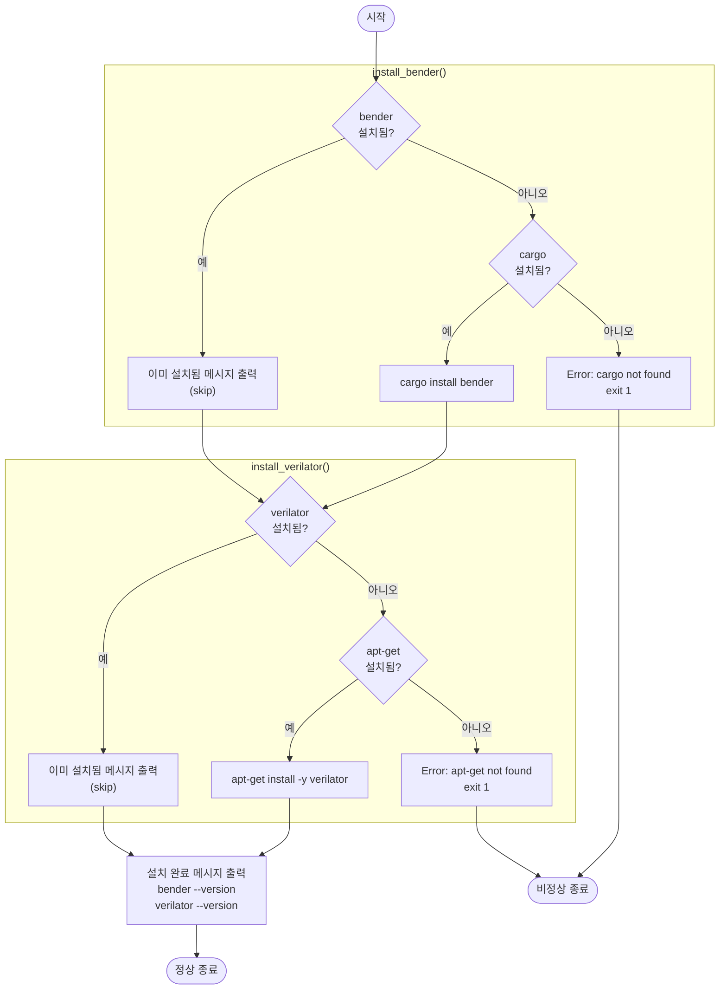

# install-deps.sh

bender(하드웨어 의존성 관리자)와 verilator(SystemVerilog 시뮬레이터)를 설치하는 스크립트. 이미 설치된 경우 건너뛴다.

---

## 사용법

```bash
bash scripts/install-deps.sh
```

> Ubuntu/Debian 계열 시스템 기준. `cargo`와 `apt-get`이 필요하다.

## 설치 버전

| 도구        | 버전    |
|-------------|---------|
| `bender`    | 0.31.0  |
| `verilator` | 5.020   |

---

## 동작 흐름



---

## 단계별 설명

### 1. bender 설치 (`install_bender`)

```bash
if command -v bender &>/dev/null; then
    # 이미 설치됨 → skip
else
    cargo install bender   # cargo로 설치
fi
```

- `command -v bender`: bender 존재 여부 확인
- `cargo install bender`: Rust 패키지 매니저로 bender 빌드 및 설치
- cargo가 없으면 에러 출력 후 `exit 1`

### 2. verilator 설치 (`install_verilator`)

```bash
if command -v verilator &>/dev/null; then
    # 이미 설치됨 → skip
else
    apt-get install -y verilator   # 패키지 관리자로 설치
fi
```

- `command -v verilator`: verilator 존재 여부 확인
- `apt-get install -y verilator`: Ubuntu/Debian 패키지로 설치
- apt-get이 없으면 에러 출력 후 `exit 1`

---

## 오류 처리

| 상황 | 동작 |
|------|------|
| bender 이미 설치됨 | 메시지 출력 후 건너뜀 |
| verilator 이미 설치됨 | 메시지 출력 후 건너뜀 |
| cargo 없음 | stderr에 에러 출력, `exit 1` |
| apt-get 없음 | stderr에 에러 출력, `exit 1` |

`set -euo pipefail`로 실행되므로 명령어 하나라도 실패하면 즉시 종료된다.

---

## 의존성

| 도구      | 용도                        | 없을 경우          |
|-----------|-----------------------------|--------------------|
| `cargo`   | bender 빌드 및 설치         | exit 1             |
| `apt-get` | verilator 패키지 설치       | exit 1             |
