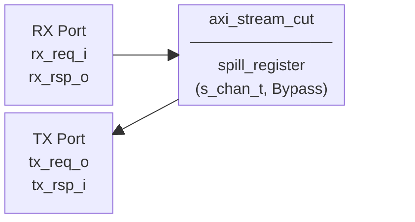
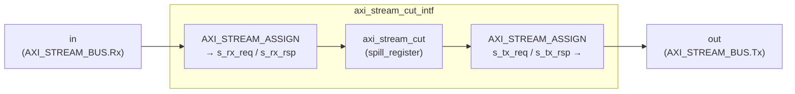

# axi_stream_cut.sv

AXI4-Stream 파이프라인 레지스터(스필 레지스터). 입력과 출력 사이의 모든 조합 경로를 차단하여 타이밍 클로저를 지원한다.

두 개의 모듈이 하나의 파일에 정의되어 있다:
- `axi_stream_cut` — struct/type 파라미터 기반 코어 모듈
- `axi_stream_cut_intf` — `AXI_STREAM_BUS` 인터페이스 래퍼

---

## Module: `axi_stream_cut`

### Parameters

| Parameter          | Type         | Default | Description                          |
|--------------------|--------------|---------|--------------------------------------|
| `Bypass`           | bit          | 0       | 1이면 레지스터 없이 직결 (pass-through) |
| `s_chan_t`         | type         | logic   | AXI Stream 채널 struct 타입           |
| `axi_stream_req_t` | type         | logic   | AXI Stream request struct 타입        |
| `axi_stream_rsp_t` | type         | logic   | AXI Stream response struct 타입       |

### Ports

| Port       | Direction | Type               | Description        |
|------------|-----------|--------------------|--------------------|
| `clk_i`    | input     | logic              | 클록               |
| `rst_ni`   | input     | logic              | 비동기 리셋 (active-low) |
| `rx_req_i` | input     | axi_stream_req_t   | 수신 요청 (tvalid + t) |
| `rx_rsp_o` | output    | axi_stream_rsp_t   | 수신 응답 (tready)    |
| `tx_req_o` | output    | axi_stream_req_t   | 송신 요청 (tvalid + t) |
| `tx_rsp_i` | input     | axi_stream_rsp_t   | 송신 응답 (tready)    |

### Block Diagram

### 동작 설명

`spill_register`를 인스턴스화하여 AXI Stream 채널 신호를 1 클록 레지스터링한다.

- `Bypass = 0`: 1-cycle 레이턴시 파이프라인 레지스터. 조합 경로 완전 차단.
- `Bypass = 1`: 직결 (레지스터 없음). 타이밍 영향 없음.

---

## Module: `axi_stream_cut_intf`

`AXI_STREAM_BUS` 인터페이스를 사용하는 래퍼. 내부에서 struct 타입을 정의하고 `axi_stream_cut`을 인스턴스화한다.

### Parameters

| Parameter   | Type         | Default | Description              |
|-------------|--------------|---------|--------------------------|
| `Bypass`    | bit          | 0       | pass-through 여부         |
| `DataWidth` | int unsigned | 0       | 데이터 버스 폭 (bits)    |
| `IdWidth`   | int unsigned | 0       | ID 폭 (bits)             |
| `DestWidth` | int unsigned | 0       | Destination 폭 (bits)    |
| `UserWidth` | int unsigned | 0       | User 사이드밴드 폭 (bits) |

### Ports

| Port    | Direction        | Description           |
|---------|------------------|-----------------------|
| `clk_i` | input logic      | 클록                  |
| `rst_ni`| input logic      | 비동기 리셋 (active-low) |
| `in`    | AXI_STREAM_BUS.Rx| 입력 포트 (Slave)      |
| `out`   | AXI_STREAM_BUS.Tx| 출력 포트 (Master)     |

### Block Diagram

