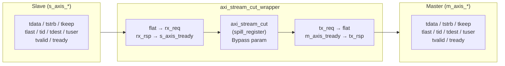

# axi_stream_cut_wrapper.sv

`axi_stream_cut`의 AMD 커스텀 IP 패키징용 flat-port 래퍼. Vivado IP 패키징 요구사항에 맞게 struct/interface 포트를 모두 `logic` 신호로 대체하고, `parameter type`을 정수 파라미터로 교체한다.

---

## Module: `axi_stream_cut_wrapper`

### Parameters

| Parameter   | Type         | Default | Description                           |
|-------------|--------------|---------|---------------------------------------|
| `Bypass`    | bit          | 0       | 1이면 레지스터 없이 직결 (pass-through) |
| `DataWidth` | int unsigned | 32      | 데이터 버스 폭 (bits)                  |
| `IdWidth`   | int unsigned | 1       | ID 폭 (bits)                          |
| `DestWidth` | int unsigned | 1       | Destination 폭 (bits)                 |
| `UserWidth` | int unsigned | 1       | User 사이드밴드 폭 (bits)              |

### Ports

| Port             | Dir    | Width        | Description                  |
|------------------|--------|--------------|------------------------------|
| `clk_i`          | input  | 1            | 클록                         |
| `rst_ni`         | input  | 1            | 비동기 리셋 (active-low)      |
| `s_axis_tdata`   | input  | DataWidth    | 입력 데이터                   |
| `s_axis_tstrb`   | input  | DataWidth/8  | 입력 바이트 스트로브            |
| `s_axis_tkeep`   | input  | DataWidth/8  | 입력 바이트 킵                 |
| `s_axis_tlast`   | input  | 1            | 입력 패킷 마지막 beat           |
| `s_axis_tid`     | input  | IdWidth      | 입력 스트림 ID                 |
| `s_axis_tdest`   | input  | DestWidth    | 입력 라우팅 목적지              |
| `s_axis_tuser`   | input  | UserWidth    | 입력 사용자 사이드밴드           |
| `s_axis_tvalid`  | input  | 1            | 입력 유효                     |
| `s_axis_tready`  | output | 1            | 입력 준비                     |
| `m_axis_tdata`   | output | DataWidth    | 출력 데이터                   |
| `m_axis_tstrb`   | output | DataWidth/8  | 출력 바이트 스트로브            |
| `m_axis_tkeep`   | output | DataWidth/8  | 출력 바이트 킵                 |
| `m_axis_tlast`   | output | 1            | 출력 패킷 마지막 beat           |
| `m_axis_tid`     | output | IdWidth      | 출력 스트림 ID                 |
| `m_axis_tdest`   | output | DestWidth    | 출력 라우팅 목적지              |
| `m_axis_tuser`   | output | UserWidth    | 출력 사용자 사이드밴드           |
| `m_axis_tvalid`  | output | 1            | 출력 유효                     |
| `m_axis_tready`  | input  | 1            | 출력 준비                     |

### Block Diagram

### 내부 구조

1. `AXI_STREAM_TYPEDEF_ALL` 매크로로 내부 req/rsp struct 타입 정의
2. flat `s_axis_*` 입력 신호 → `rx_req` struct 필드 assign
3. `axi_stream_cut` 코어 인스턴스 (struct 인터페이스)
4. `tx_req` struct 필드 → flat `m_axis_*` 출력 신호 assign
