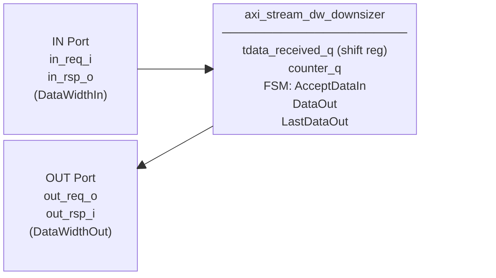
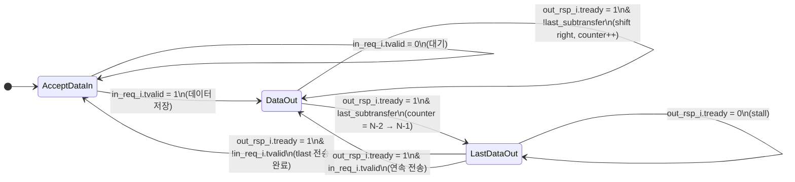

# axi_stream_dw_downsizer.sv

AXI4-Stream 데이터 폭 다운사이저(Downsizer). 넓은 입력 데이터(`DataWidthIn`)를 좁은 출력 데이터(`DataWidthOut`)로 분할하여 순차 전송한다. `DataWidthIn / DataWidthOut`개의 서브 트랜스퍼로 분리되며 LSB부터 먼저 출력된다.

두 개의 모듈이 하나의 파일에 정의되어 있다:
- `axi_stream_dw_downsizer` — struct/type 파라미터 기반 코어 모듈
- `axi_stream_dw_downsizer_intf` — `AXI_STREAM_BUS` 인터페이스 래퍼

---

## Module: `axi_stream_dw_downsizer`

### Parameters

| Parameter               | Type         | Default | Description                              |
|-------------------------|--------------|---------|------------------------------------------|
| `DataWidthIn`           | int unsigned | 64      | 입력 데이터 폭 (bits); DataWidthOut의 정수배여야 함 |
| `DataWidthOut`          | int unsigned | 8       | 출력 데이터 폭 (bits); DataWidthIn보다 작아야 함 |
| `IdWidth`               | int unsigned | 0       | ID 폭 (bits)                             |
| `DestWidth`             | int unsigned | 0       | Destination 폭 (bits)                    |
| `UserWidth`             | int unsigned | 0       | User 사이드밴드 폭 (bits)                 |
| `axi_stream_in_req_t`   | type         | logic   | 입력 request struct 타입                  |
| `axi_stream_in_rsp_t`   | type         | logic   | 입력 response struct 타입                 |
| `axi_stream_out_req_t`  | type         | logic   | 출력 request struct 타입                  |
| `axi_stream_out_rsp_t`  | type         | logic   | 출력 response struct 타입                 |

### Local Parameters (자동 계산)

| Localparam            | 공식                          | 설명                        |
|-----------------------|-------------------------------|-----------------------------|
| `TotalSubTransfers`   | DataWidthIn / DataWidthOut    | 서브 트랜스퍼 총 개수          |
| `MaxSubTransferIndex` | TotalSubTransfers - 1         | 마지막 서브 트랜스퍼 인덱스     |
| `CounterWidth`        | $clog2(TotalSubTransfers)     | 카운터 비트 수                |

### Ports

| Port        | Direction | Type                    | Description         |
|-------------|-----------|-------------------------|---------------------|
| `clk_i`     | input     | logic                   | 클록                |
| `rst_ni`    | input     | logic                   | 비동기 리셋 (active-low) |
| `in_req_i`  | input     | axi_stream_in_req_t     | 입력 요청 (넓은 데이터) |
| `in_rsp_o`  | output    | axi_stream_in_rsp_t     | 입력 응답 (tready)   |
| `out_req_o` | output    | axi_stream_out_req_t    | 출력 요청 (좁은 데이터) |
| `out_rsp_i` | input     | axi_stream_out_rsp_t    | 출력 응답 (tready)   |

### Block Diagram

### FSM 상태 다이어그램

### 동작 설명

1. **AcceptDataIn**: `in_req_i.tvalid`를 기다려 입력 데이터를 내부 레지스터(`tdata_received_q`)에 저장한 후 `DataOut`으로 전이.
2. **DataOut**: 매 클록마다 LSB부터 `DataWidthOut`비트씩 출력. 출력 후 내부 레지스터를 오른쪽으로 `DataWidthOut`비트 shift. `MaxSubTransferIndex - 1`에 도달하면 `LastDataOut`으로 전이.
3. **LastDataOut**: 마지막 서브 트랜스퍼를 출력. `tlast`를 원래 입력의 `tlast`로 설정. 출력 완료 후 다음 입력 유무에 따라 `DataOut` 또는 `AcceptDataIn`으로 전이.

**전송 예시 (DataWidthIn=32, DataWidthOut=8): 입력 `0x12_34_56_EF`**

| 서브 트랜스퍼 | 출력 데이터 | tlast |
|-------------|------------|-------|
| 0 (첫 번째) | `0xEF`     | 0     |
| 1           | `0x56`     | 0     |
| 2           | `0x34`     | 0     |
| 3 (마지막)  | `0x12`     | (원본 tlast) |

---

## Module: `axi_stream_dw_downsizer_intf`

`AXI_STREAM_BUS` 인터페이스를 사용하는 래퍼. 내부에서 in/out 각각의 struct 타입을 정의하고 `axi_stream_dw_downsizer`를 인스턴스화한다.

### Parameters

| Parameter    | Type         | Default | Description              |
|--------------|--------------|---------|--------------------------|
| `DataWidthIn`  | int unsigned | 64    | 입력 데이터 폭 (bits)    |
| `DataWidthOut` | int unsigned | 8     | 출력 데이터 폭 (bits)    |
| `IdWidth`      | int unsigned | 0     | ID 폭 (bits)             |
| `DestWidth`    | int unsigned | 0     | Destination 폭 (bits)    |
| `UserWidth`    | int unsigned | 0     | User 사이드밴드 폭 (bits) |

### Ports

| Port      | Direction              | Description              |
|-----------|------------------------|--------------------------|
| `clk_i`   | input logic            | 클록                     |
| `rst_ni`  | input logic            | 비동기 리셋 (active-low)  |
| `axis_in` | AXI_STREAM_BUS.Rx      | 입력 포트 (넓은 데이터)    |
| `axis_out`| AXI_STREAM_BUS.Tx      | 출력 포트 (좁은 데이터)    |
