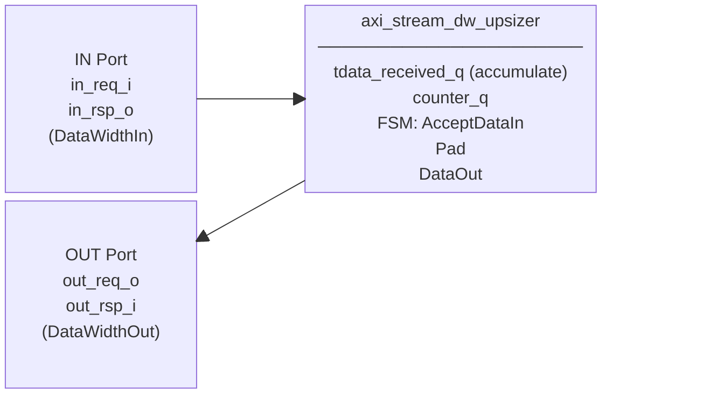
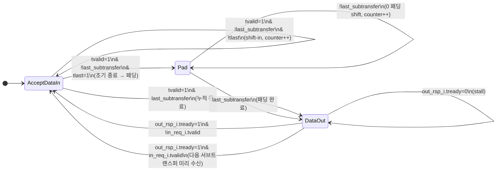

# axi_stream_dw_upsizer.sv

AXI4-Stream 데이터 폭 업사이저(Upsizer). 좁은 입력 데이터(`DataWidthIn`)를 `DataWidthOut / DataWidthIn`개만큼 누적하여 넓은 출력 데이터(`DataWidthOut`)로 조립 전송한다. 입력 스트림에서 `tlast`가 조기에 도달하면 나머지 슬롯을 0으로 패딩한다.

두 개의 모듈이 하나의 파일에 정의되어 있다:
- `axi_stream_dw_upsizer` — struct/type 파라미터 기반 코어 모듈
- `axi_stream_dw_upsizer_intf` — `AXI_STREAM_BUS` 인터페이스 래퍼

---

## Module: `axi_stream_dw_upsizer`

### Parameters

| Parameter               | Type         | Default | Description                               |
|-------------------------|--------------|---------|-------------------------------------------|
| `DataWidthIn`           | int unsigned | 8       | 입력 데이터 폭 (bits); DataWidthOut보다 작아야 함 |
| `DataWidthOut`          | int unsigned | 64      | 출력 데이터 폭 (bits); DataWidthIn의 정수배여야 함 |
| `IdWidth`               | int unsigned | 0       | ID 폭 (bits)                              |
| `DestWidth`             | int unsigned | 0       | Destination 폭 (bits)                     |
| `UserWidth`             | int unsigned | 0       | User 사이드밴드 폭 (bits)                  |
| `axi_stream_in_req_t`   | type         | logic   | 입력 request struct 타입                   |
| `axi_stream_in_rsp_t`   | type         | logic   | 입력 response struct 타입                  |
| `axi_stream_out_req_t`  | type         | logic   | 출력 request struct 타입                   |
| `axi_stream_out_rsp_t`  | type         | logic   | 출력 response struct 타입                  |

### Local Parameters (자동 계산)

| Localparam            | 공식                           | 설명                        |
|-----------------------|--------------------------------|-----------------------------|
| `TotalSubTransfers`   | DataWidthOut / DataWidthIn     | 서브 트랜스퍼 총 개수          |
| `MaxSubTransferIndex` | TotalSubTransfers - 1          | 마지막 서브 트랜스퍼 인덱스     |
| `CounterWidth`        | $clog2(TotalSubTransfers)      | 카운터 비트 수                |

### Ports

| Port        | Direction | Type                    | Description           |
|-------------|-----------|-------------------------|-----------------------|
| `clk_i`     | input     | logic                   | 클록                  |
| `rst_ni`    | input     | logic                   | 비동기 리셋 (active-low) |
| `in_req_i`  | input     | axi_stream_in_req_t     | 입력 요청 (좁은 데이터) |
| `in_rsp_o`  | output    | axi_stream_in_rsp_t     | 입력 응답 (tready)     |
| `out_req_o` | output    | axi_stream_out_req_t    | 출력 요청 (넓은 데이터) |
| `out_rsp_i` | input     | axi_stream_out_rsp_t    | 출력 응답 (tready)     |

### Block Diagram

### FSM 상태 다이어그램

### 동작 설명

1. **AcceptDataIn**: 입력 비트를 `DataWidthOut` 레지스터의 MSB로 shift-in하며 누적(`{data, prev[DataWidthOut-1:DataWidthIn]}`). `counter_q`로 진행 추적.
   - `last_subtransfer` 도달 시 → `DataOut`
   - `tlast=1` & 아직 채워지지 않으면 → `Pad`
2. **Pad**: 입력 수신 정지(`tready=0`). 레지스터를 `DataWidthIn`비트씩 오른쪽 shift하여 남은 슬롯을 0으로 채움.
3. **DataOut**: 조립 완료된 `DataWidthOut` 데이터를 출력. `out_rsp_i.tready` 수신 시 `AcceptDataIn`으로 복귀.

**전송 예시 (DataWidthIn=8, DataWidthOut=32): 입력 `0x12, 0x34, 0x56, 0xEF`**

| 서브 트랜스퍼 | 입력 | 레지스터 상태           |
|-------------|------|------------------------|
| 0           | 0xEF | `??_??_??_EF` (shift-in MSB) |
| 1           | 0x56 | `??_??_56_EF`           |
| 2           | 0x34 | `??_34_56_EF`           |
| 3           | 0x12 | `12_34_56_EF` → DataOut |

**패딩 예시 (3번째 beat에 tlast=1): 입력 `0x12, 0x34, 0xEF(last)`**

| 서브 트랜스퍼 | 입력  | 레지스터 상태          |
|-------------|-------|----------------------|
| 0           | 0xEF  | `??_??_??_EF`        |
| 1           | 0x34  | `??_??_34_EF`        |
| 2           | 0x12(last) | `??_12_34_EF` → Pad |
| Pad         | —     | `00_12_34_EF` → DataOut |

출력: `0x00_12_34_EF`, `tlast=1`

---

## Module: `axi_stream_dw_upsizer_intf`

`AXI_STREAM_BUS` 인터페이스를 사용하는 래퍼. 내부에서 in/out 각각의 struct 타입을 정의하고 `axi_stream_dw_upsizer`를 인스턴스화한다.

### Parameters

| Parameter      | Type         | Default | Description              |
|----------------|--------------|---------|--------------------------|
| `DataWidthIn`  | int unsigned | 64      | 입력 데이터 폭 (bits)    |
| `DataWidthOut` | int unsigned | 8       | 출력 데이터 폭 (bits)    |
| `IdWidth`      | int unsigned | 0       | ID 폭 (bits)             |
| `DestWidth`    | int unsigned | 0       | Destination 폭 (bits)    |
| `UserWidth`    | int unsigned | 0       | User 사이드밴드 폭 (bits) |

### Ports

| Port       | Direction         | Description              |
|------------|-------------------|--------------------------|
| `clk_i`    | input logic       | 클록                     |
| `rst_ni`   | input logic       | 비동기 리셋 (active-low)  |
| `axis_in`  | AXI_STREAM_BUS.Rx | 입력 포트 (좁은 데이터)    |
| `axis_out` | AXI_STREAM_BUS.Tx | 출력 포트 (넓은 데이터)    |
