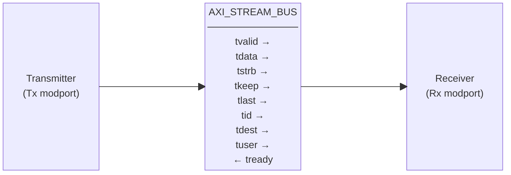
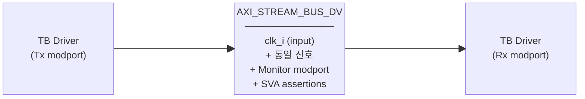

# axi_stream_intf.sv

AXI4-Stream 버스 인터페이스 정의 파일. 구조적 연결용 `AXI_STREAM_BUS`와 검증용 `AXI_STREAM_BUS_DV` 두 개의 SystemVerilog interface를 제공한다.

---

## Interface: `AXI_STREAM_BUS`

클록 없는 순수 구조체 인터페이스. DUT 내부 모듈 간 연결에 사용한다.

### Parameters

| Parameter   | Type         | Default | Description              |
|-------------|--------------|---------|--------------------------|
| `DataWidth` | int unsigned | 0       | 데이터 버스 폭 (bits)    |
| `IdWidth`   | int unsigned | 0       | 스트림 ID 폭 (bits)      |
| `DestWidth` | int unsigned | 0       | 목적지 필드 폭 (bits)    |
| `UserWidth` | int unsigned | 0       | 사용자 사이드밴드 폭 (bits) |

### Signals

| Signal   | Width           | Description                  |
|----------|-----------------|------------------------------|
| `tvalid` | 1               | 전송 유효 (Transmitter 구동)  |
| `tready` | 1               | 수신 준비 (Receiver 구동)     |
| `tdata`  | DataWidth       | 페이로드 데이터               |
| `tstrb`  | DataWidth/8     | 바이트 스트로브 (유효 바이트 표시) |
| `tkeep`  | DataWidth/8     | 바이트 킵 (null 바이트 표시)   |
| `tlast`  | 1               | 패킷의 마지막 beat 표시        |
| `tid`    | IdWidth         | 스트림 ID                     |
| `tdest`  | DestWidth       | 라우팅 목적지                  |
| `tuser`  | UserWidth       | 사용자 정의 사이드밴드          |

### Modports

| Modport | tvalid/tdata/... | tready | 용도                       |
|---------|------------------|--------|----------------------------|
| `Tx`    | output           | input  | 데이터 송신측 (Master)      |
| `Rx`    | input            | output | 데이터 수신측 (Slave)       |

### Block Diagram

---

## Interface: `AXI_STREAM_BUS_DV`

클록을 포함하는 검증용 인터페이스. 테스트벤치 드라이버/모니터가 사용한다.  
`AXI_STREAM_BUS`와 동일한 신호 목록에 아래가 추가된다.

### Additional Port

| Port    | Direction | Description                      |
|---------|-----------|----------------------------------|
| `clk_i` | input     | 클록 신호 (assertion 동기화용)    |

### Modports

| Modport   | 추가 용도                                    |
|-----------|----------------------------------------------|
| `Tx`      | 드라이버 TX (AXI_STREAM_BUS.Tx 동일)         |
| `Rx`      | 드라이버 RX (AXI_STREAM_BUS.Rx 동일)         |
| `Monitor` | 모니터 전용 — 모든 신호 input (read-only)    |

### SVA Assertions (`ifndef VERILATOR`)

| Assertion | 설명 |
|-----------|------|
| `tvalid && !tready \|=> $stable(tdata)` | valid 중 데이터 불변 |
| `tvalid && !tready \|=> $stable(tstrb/tkeep/tlast/tid/tdest/tuser)` | 기타 채널 신호 불변 |
| `tvalid && !tready \|=> tvalid` | valid deassert 금지 |

### Block Diagram

