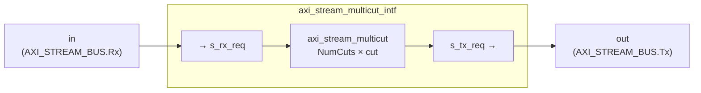

# axi_stream_multicut.sv

여러 개의 AXI4-Stream 파이프라인 레지스터를 직렬로 연결한 모듈. `axi_stream_cut`을 `NumCuts`개 체이닝하여 긴 경로에서 다단 레지스터링을 지원한다.

두 개의 모듈이 하나의 파일에 정의되어 있다:
- `axi_stream_multicut` — struct/type 파라미터 기반 코어 모듈
- `axi_stream_multicut_intf` — `AXI_STREAM_BUS` 인터페이스 래퍼

---

## Module: `axi_stream_multicut`

### Parameters

| Parameter          | Type         | Default | Description                        |
|--------------------|--------------|---------|------------------------------------|
| `NumCuts`          | int unsigned | 0       | 파이프라인 스테이지 수 (레지스터 개수) |
| `s_chan_t`         | type         | logic   | AXI Stream 채널 struct 타입         |
| `axi_stream_req_t` | type         | logic   | AXI Stream request struct 타입      |
| `axi_stream_rsp_t` | type         | logic   | AXI Stream response struct 타입     |

### Ports

| Port       | Direction | Type               | Description        |
|------------|-----------|--------------------|--------------------|
| `clk_i`    | input     | logic              | 클록               |
| `rst_ni`   | input     | logic              | 비동기 리셋 (active-low) |
| `rx_req_i` | input     | axi_stream_req_t   | 수신 요청           |
| `rx_rsp_o` | output    | axi_stream_rsp_t   | 수신 응답           |
| `tx_req_o` | output    | axi_stream_req_t   | 송신 요청           |
| `tx_rsp_i` | input     | axi_stream_rsp_t   | 송신 응답           |

### Block Diagram

### 동작 설명

`generate for` 루프로 `NumCuts`개의 `axi_stream_cut` (Bypass=0) 인스턴스를 내부 req/rsp 배열(`cut_req[NumCuts+1]`, `cut_rsp[NumCuts+1]`)로 연결한다.

**특수 케이스:**
- `NumCuts = 0`: 입력과 출력을 직결(`assign tx_req_o = rx_req_i; assign rx_rsp_o = tx_rsp_i`)

| NumCuts | 레이턴시 | 조합 경로 차단 |
|---------|---------|--------------|
| 0       | 0 cycle  | 없음          |
| N       | N cycle  | 완전 차단      |

---

## Module: `axi_stream_multicut_intf`

`AXI_STREAM_BUS` 인터페이스를 사용하는 래퍼. 내부에서 struct를 정의하고 `axi_stream_multicut`을 인스턴스화한다.

### Parameters

| Parameter   | Type         | Default | Description              |
|-------------|--------------|---------|--------------------------|
| `NumCuts`   | int unsigned | 0       | 파이프라인 스테이지 수     |
| `DataWidth` | int unsigned | 0       | 데이터 버스 폭 (bits)    |
| `IdWidth`   | int unsigned | 0       | ID 폭 (bits)             |
| `DestWidth` | int unsigned | 0       | Destination 폭 (bits)    |
| `UserWidth` | int unsigned | 0       | User 사이드밴드 폭 (bits) |

### Ports

| Port    | Direction        | Description           |
|---------|------------------|-----------------------|
| `clk_i` | input logic      | 클록                  |
| `rst_ni`| input logic      | 비동기 리셋 (active-low) |
| `in`    | AXI_STREAM_BUS.Rx| 입력 포트 (Slave)      |
| `out`   | AXI_STREAM_BUS.Tx| 출력 포트 (Master)     |

### Block Diagram

