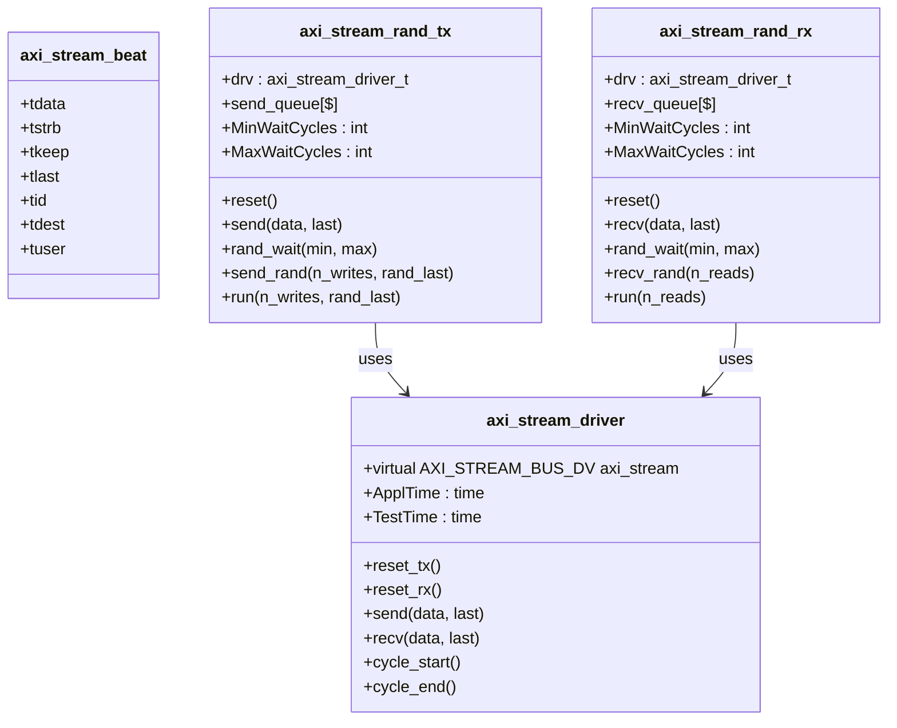
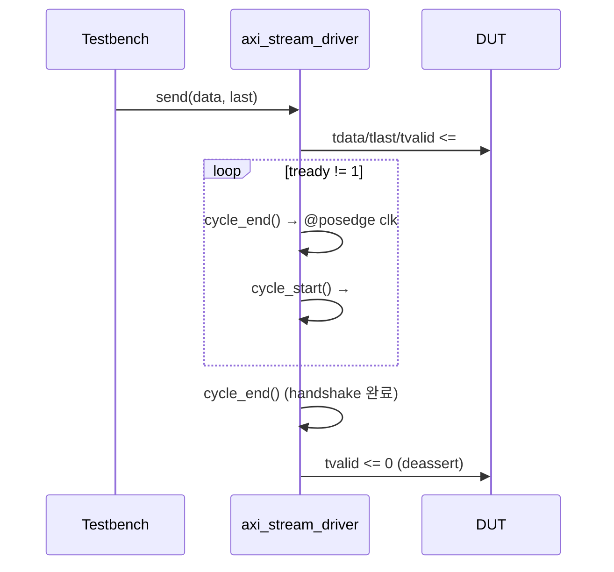

# axi_stream_test.sv

AXI4-Stream 테스트벤치 유틸리티 패키지 (`axi_stream_test`). 랜덤 자극 생성과 데이터 수집을 위한 드라이버 클래스를 제공한다.

---

## Package: `axi_stream_test`

### 포함 클래스 개요



---

## Class: `axi_stream_driver`

AXI4-Stream 인터페이스 저수준 드라이버. 단일 beat 전송/수신을 처리한다.

### Parameters

| Parameter   | Type | Default | Description                       |
|-------------|------|---------|-----------------------------------|
| `DataWidth` | int  | 0       | 데이터 폭 (bits)                   |
| `IdWidth`   | int  | 0       | ID 폭 (bits)                      |
| `DestWidth` | int  | 0       | Destination 폭 (bits)             |
| `UserWidth` | int  | 0       | User 사이드밴드 폭 (bits)          |
| `ApplTime`  | time | 0ns     | 자극 인가 시간 (클록 후 딜레이)     |
| `TestTime`  | time | 0ns     | 샘플링 시간 (클록 전 체크 포인트)   |

### Methods

| Method       | 설명                                                         |
|--------------|--------------------------------------------------------------|
| `reset_tx()` | 모든 TX 신호를 0으로 초기화 (`tvalid=0`)                      |
| `reset_rx()` | RX 신호 초기화 (`tready=0`)                                  |
| `send(data, last)` | 1 beat 전송. `tready=1`이 될 때까지 대기 후 클록 상승 엣지에 확정 |
| `recv(data, last)` | 1 beat 수신. `tvalid=1`이 될 때까지 대기 후 데이터 캡처       |

### 타이밍 다이어그램



---

## Class: `axi_stream_beat`

단일 beat 데이터를 담는 컨테이너 클래스. 모든 채널 필드를 포함한다.

---

## Class: `axi_stream_rand_tx`

랜덤 데이터를 생성하여 전송하는 마스터 드라이버.

### Parameters

| Parameter       | Type | 설명                              |
|-----------------|------|-----------------------------------|
| `MinWaitCycles` | int  | beat 사이 최소 대기 사이클 수       |
| `MaxWaitCycles` | int  | beat 사이 최대 대기 사이클 수       |

### 주요 필드

| 필드         | 타입      | 설명                                     |
|--------------|-----------|------------------------------------------|
| `send_queue` | `data_t[$]` | 전송된 데이터 큐 (검증용 골든 참조 데이터) |

### 주요 메서드

| 메서드                         | 설명                                              |
|-------------------------------|---------------------------------------------------|
| `send_rand(n_writes, rand_last)` | `n_writes`개 랜덤 데이터 전송. `rand_last=1`이면 tlast도 랜덤. 전송 데이터를 `send_queue`에 저장 |
| `rand_wait(min, max)`         | `[min, max]` 범위의 랜덤 클록 수 대기              |

---

## Class: `axi_stream_rand_rx`

데이터를 수신하여 큐에 저장하는 슬레이브 드라이버.

### 주요 필드

| 필드         | 타입      | 설명                                     |
|--------------|-----------|------------------------------------------|
| `recv_queue` | `data_t[$]` | 수신된 데이터 큐 (검증용 실제 수신 데이터) |

### 주요 메서드

| 메서드                  | 설명                                              |
|------------------------|---------------------------------------------------|
| `recv_rand(n_reads)`   | `n_reads`개 데이터 수신. 수신 데이터를 `recv_queue`에 저장 |
| `rand_wait(min, max)`  | `[min, max]` 범위의 랜덤 클록 수 대기              |

---

## 검증 패턴

테스트벤치는 일반적으로 `send_queue`와 `recv_queue`를 비교하여 정확성을 검증한다:

```systemverilog
// 업사이저 검증 예시 (DW_IN=8, DW_OUT=32)
for (int i = 0; i < master_drv.send_queue.size() / 4; i++) begin
  assert(slave_drv.recv_queue[i] == {
    master_drv.send_queue[i*4 + 3],
    master_drv.send_queue[i*4 + 2],
    master_drv.send_queue[i*4 + 1],
    master_drv.send_queue[i*4 + 0]
  });
end
```
