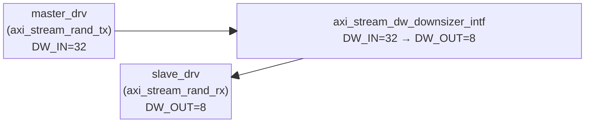
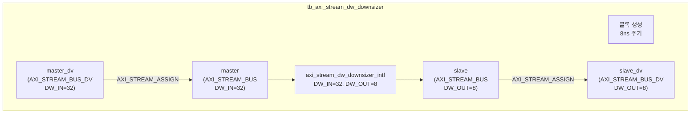

# tb_axi_stream_dw_downsizer.sv

`axi_stream_dw_downsizer_intf`를 검증하는 테스트벤치. DW_IN=32bit → DW_OUT=8bit 다운사이저를 대상으로 다양한 전송 패턴과 랜덤 테스트를 수행한다.

---

## 설정

| 파라미터       | 값    | 설명                       |
|---------------|-------|----------------------------|
| `DW_IN`       | 32    | 입력 데이터 폭 (bits)       |
| `DW_OUT`      | 8     | 출력 데이터 폭 (bits)       |
| `ID_WIDTH`    | 0     | ID 폭 없음                  |
| `DEST_WIDTH`  | 0     | Destination 폭 없음         |
| `USER_WIDTH`  | 0     | User 폭 없음                |
| `tCK`         | 8ns   | 클록 주기 (125 MHz)         |

---

## 구조도





---

## 테스트 케이스

| 테스트 | 함수 | 설명 |
|--------|------|------|
| TEST 1a | `transmit_and_assert(1'b0)` | 단일 전송, tlast=0 |
| TEST 1b | `transmit_and_assert(1'b1)` | 단일 전송, tlast=1 |
| TEST 2 | `double_transmit_and_assert(1'b1, 0, 0)` | 연속 2회 전송, 지연 없음 |
| TEST 3 | `double_transmit_and_assert(1'b1, 4, 0)` | 송신 지연 4 cycle |
| TEST 4 | `double_transmit_and_assert(1'b1, 0, 1)` | 수신 지연 1 cycle |
| TEST 5 | `transmit_and_assert_with_interrupt(1'b1)` | 수신 중간에 tready=0 인터럽트 |
| TEST 6 | `random_transmit()` | 200 beat 랜덤 전송/수신 |

### 전송 검증 예시 (TEST 1: `0x12_34_56_EF`)

```
입력 1 beat (32-bit): 0x12_34_56_EF
출력 4 beats (8-bit, LSB first):
  beat 0: 0xEF, tlast=0
  beat 1: 0x56, tlast=0
  beat 2: 0x34, tlast=0
  beat 3: 0x12, tlast=last
```

### 랜덤 테스트 검증 로직

```systemverilog
// send_queue[i] (32-bit) == recv_queue의 4개 연속 8-bit beat
for (int i = 0; i < master_drv.send_queue.size(); i++) begin
  assert(master_drv.send_queue[i] == {
    slave_drv.recv_queue[i*4 + 3],
    slave_drv.recv_queue[i*4 + 2],
    slave_drv.recv_queue[i*4 + 1],
    slave_drv.recv_queue[i*4 + 0]
  });
end
```

---

## 타이밍 파라미터

| 드라이버     | MinWaitCycles | MaxWaitCycles | TestTime |
|------------|---------------|---------------|---------|
| master_drv | 0             | 50            | tCK/2 = 4ns |
| slave_drv  | 0             | 50            | tCK/2 = 4ns |

---

## 종료 조건

모든 테스트 완료 후 `$stop()` 호출 (exit code 134). assertion 실패 없으면 PASS.
