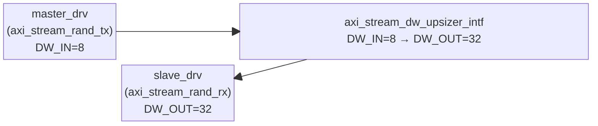
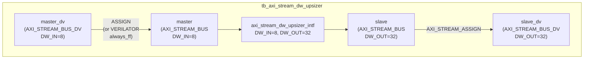

# tb_axi_stream_dw_upsizer.sv

`axi_stream_dw_upsizer_intf`를 검증하는 테스트벤치. DW_IN=8bit → DW_OUT=32bit 업사이저를 대상으로 전체 전송, 부분 전송(패딩), 읽기 지연, 랜덤 테스트를 수행한다.

---

## 설정

| 파라미터       | 값    | 설명                       |
|---------------|-------|----------------------------|
| `DW_IN`       | 8     | 입력 데이터 폭 (bits)       |
| `DW_OUT`      | 32    | 출력 데이터 폭 (bits)       |
| `ID_WIDTH`    | 0     | ID 폭 없음                  |
| `DEST_WIDTH`  | 0     | Destination 폭 없음         |
| `USER_WIDTH`  | 0     | User 폭 없음                |
| `tCK`         | 8ns   | 클록 주기 (125 MHz)         |

---

## 구조도





> **Verilator 호환성**: `master_dv.tready` 경로에 ICO 루프 방지를 위해 `` `ifdef VERILATOR ``로 `always_ff @(posedge/negedge clk_i)` 샘플링 사용.

---

## 테스트 케이스

| 번호 | 함수 | 설명 |
|------|------|------|
| TEST 1 | `transmit_and_assert(1'b0)` | 4 beats 전송, tlast=0 |
| TEST 2 | `transmit_and_assert(1'b1)` | 4 beats 전송, tlast=1 |
| TEST 3 | `transmit_and_assert_partial_1()` | 3 beats + tlast (1 패딩) |
| TEST 4 | `transmit_and_assert_partial_2()` | 1 beat + tlast (3 패딩) |
| TEST 5 | `double_transmit_and_assert(1'b0)` | 8 beats 연속 전송, tlast=0 |
| TEST 6 | `double_transmit_and_assert(1'b1)` | 8 beats 연속 전송, tlast=1 |
| TEST 7 | `double_transmit_and_assert_partial()` | 7 beats (2번째 패킷에 패딩) |
| TEST 8 | `double_transmit_and_assert_with_read_delay(1'b1, 1)` | READ_DELAY=1 |
| TEST 9 | `double_transmit_and_assert_partial_with_read_delay(1)` | 패딩 + READ_DELAY=1 |
| TEST 10 | `double_transmit_and_assert_with_read_delay(1'b1, 4)` | READ_DELAY=4 |
| TEST 11 | `double_transmit_and_assert_partial_with_read_delay(4)` | 패딩 + READ_DELAY=4 |
| TEST 12 | `random_transmit()` | 800 beats 랜덤 전송/수신 |

### 전송 검증 예시

**TEST 1 (4 beats 전체)**: `0x12, 0x34, 0x56, 0xEF` → `0xEF_56_34_12`

**TEST 3 (3 beats + tlast=1)**: `0x12, 0x34, 0xEF(last)` → `0x00_EF_34_12`, tlast=1
```
0x12 → shift-in MSB : __________12
0x34 → shift-in MSB : ________34_12
0xEF (last) → Pad   : ____EF_34_12
Pad 1개             : 00_EF_34_12  → 출력
```

**TEST 4 (1 beat + tlast=1)**: `0x76(last)` → `0x00_00_00_76`, tlast=1

### 랜덤 테스트 검증 로직

```systemverilog
// send_queue의 4개 연속 8-bit == recv_queue[i] (32-bit)
for (int i = 0; i < master_drv.send_queue.size() / 4; i++) begin
  assert(slave_drv.recv_queue[i] == {
    master_drv.send_queue[i*4 + 3],
    master_drv.send_queue[i*4 + 2],
    master_drv.send_queue[i*4 + 1],
    master_drv.send_queue[i*4 + 0]
  });
end
```

---

## 타이밍 파라미터

| 드라이버     | MinWaitCycles | MaxWaitCycles | TestTime    |
|------------|---------------|---------------|-------------|
| master_drv | 0             | 50            | tCK/2 = 4ns |
| slave_drv  | 0             | 50            | tCK/2 = 4ns |

---

## 종료 조건

모든 테스트 완료 후 `$stop()` 호출 (exit code 134). assertion 실패 없으면 PASS.
